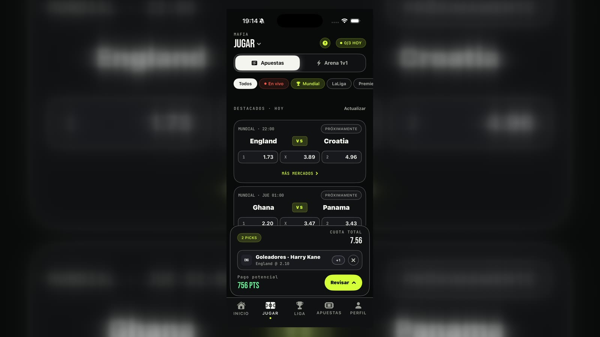
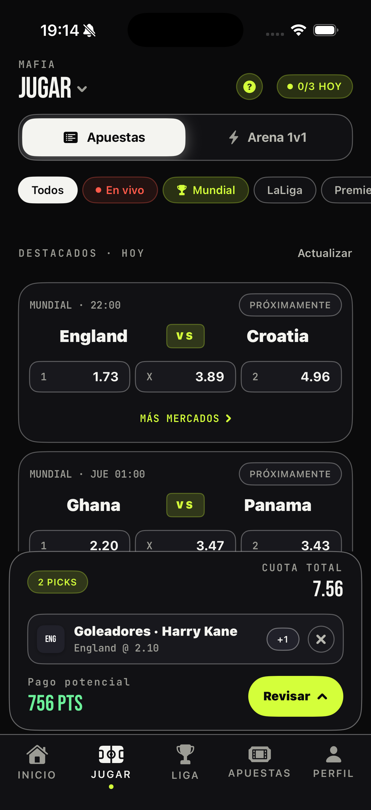
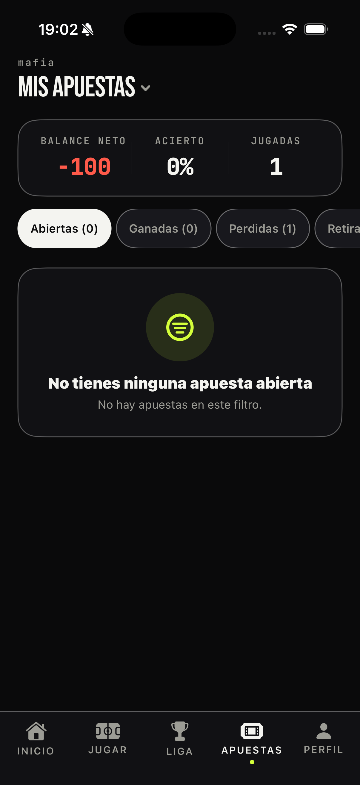
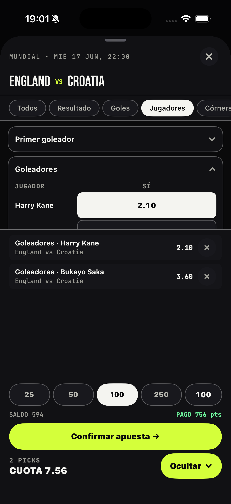

# Betsy

Betsy is a mobile-first social sports betting game built for private competition between friends using virtual points, not real money.

This monorepo holds the native iOS app, the Firebase backend, the marketing site, the Remotion promo project and source kept from earlier iOS iterations.

## Monorepo map

| Path | Purpose |
| --- | --- |
| `APP/` and `3x.xcodeproj/` | Current native SwiftUI application |
| `backend/firebase/` | Firestore rules, indexes and Cloud Functions |
| `web/` | Next.js marketing, support and legal website |
| `promo/` | Remotion compositions for tutorials and social videos |
| `archive/legacy-ios-july/` | Unique services from the July iOS iteration |
| `archive/legacy-ios-may/` | Unique models and UI components from the May iteration |
| `docs/` | Product, architecture, setup and real screenshots |

## Real app screens

| League | Markets | Bet slip |
| --- | --- | --- |
|  |  |  |

The product combines:
- private leagues
- daily betting limits
- virtual balance and rankings
- 1v1 Arena challenges
- user profiles and avatars
- multilingual UX
- a simulation layer for testing full product flows before real-time sports integrations are connected

## Product summary

Betsy turns the way friends already talk about sports into a structured competitive system.

Instead of leaving predictions, bragging rights, arguments, screenshots, and "I told you so" moments scattered across WhatsApp groups and casual conversation, Betsy gives each group its own league, rules, standings, tickets, and direct rivalries.

There is no real-money betting. The emotional loop is built around status, points, competition, rank, and social identity.

## Core experience

1. A user creates an account or signs in.
2. The user creates a private league or joins one with a code.
3. Each league defines its own rules:
   - allowed competitions
   - starting balance
   - bets per day
   - betting window
   - Arena challenge behavior
4. Members place picks on available matches using virtual points.
5. Tickets resolve later and update points, balance, and league ranking.
6. Users can challenge each other directly in Arena for 1v1 duels.
7. The app keeps history, rankings, and profile-level context visible over time.

## What exists today

The current project is already beyond a static prototype. It includes:
- onboarding and splash flow
- sign up / sign in with Firebase Auth
- profile and avatar system
- private league creation and join by code
- per-league configuration
- betting flow with single and multi-pick tickets
- ticket history with open / won / lost / withdrawn states
- Arena challenge flow with pending, incoming, active, rejected states
- local notifications and in-app challenge banners
- multilingual app state
- developer/tester switching tools
- simulated matches and simulated day progression for product testing

## Technical stack

- iOS app built in SwiftUI
- Xcode project: `3x.xcodeproj`
- Firebase Authentication
- Firestore for leagues, users, challenges, arenas, and state sync
- local storage via `AppStorage` for lightweight persisted UI state
- real sports APIs for odds, scores and fixtures, behind a repository layer that can swap in simulated data

Inside `APP/`, `Features/` holds the product modules (Onboarding, Home, Play, League, Bets, Arena, Profile), `Shared/` the reusable UI, services and design system pieces, and `Resources/` the supporting assets.

## Important product concepts

### Private leagues
Each league is a self-contained competitive environment with its own rules, members, and standings.

### Virtual economy
Users do not deposit money. They compete with virtual balances and score movement.

### Daily pacing
Leagues can limit bets per day, making the game feel strategic rather than spammy.

### Arena
Arena is the direct challenge layer. It creates emotional spikes inside a league by letting one user call out another user for a head-to-head duel.

### Developer simulation
The app keeps testing-oriented flows so product behavior can be validated without spending API calls or waiting on real fixtures. See [Dev Mode](./docs/DEV_MODE.md).

## Documentation

- [Architecture Overview](./docs/ARCHITECTURE.md)
- [Dev Mode and User Mode](./docs/DEV_MODE.md)
- [Firebase Setup](./docs/FIREBASE_SETUP.md)

## Running the app

1. Open `3x.xcodeproj` in Xcode.
2. Add your own `APP/GoogleService-Info.plist` for the intended Firebase project.
3. Copy `APISecrets.example.swift` to `APISecrets.swift` and add your own sports API credentials.
4. Enable `Email/Password` in Firebase Authentication.
5. Build and run on simulator or device.

The public repository intentionally excludes all live service credentials.

## CA

Betsy és una app social esportiva per crear lligues privades, competir amb punts virtuals, resoldre apostes amb resultats reals i desafiar amics en duels 1 contra 1.

## ES

Betsy es una app social deportiva para crear ligas privadas, competir con puntos virtuales, resolver apuestas con resultados reales y desafiar amigos en duelos 1 contra 1.

## Notes

- The app currently mixes real-product flows with simulation-friendly data where needed.
- Real odds, fixtures, live events, and final production sports integrations can be connected later without redesigning the whole app model.
- The product is intentionally designed to be testable before becoming fully data-live.
